# 公式索引与原式核对

> PDF 文本层会破坏分式、上下标与矩阵结构，因此以下公式均保留经视觉核对的原式裁图。中文只解释公式作用，不改写数学内容。

| ID | 原编号 | 页码 | 含义 |
|---|---:|---:|---|
| [E001](#E001) | (1) | 3 | 旋翼 UAV 推进功率模型 |
| [E002](#E002) | (2) | 3 | 单时间步推进能耗 |
| [E003](#E003) | (3) | 3 | UAV 剩余能量 |
| [E004](#E004) | (4) | 4 | 传感器感知域 |
| [E005](#E005) | (5) | 4 | 检测概率与虚警概率 |
| [E006](#E006) | (6) | 4 | 局部目标概率的贝叶斯更新 |
| [E007](#E007) | (7) | 4 | 局部环境不确定度（信息熵） |
| [E008](#E008) | (8) | 4 | 全局环境不确定度融合 |
| [E009](#E009) | (9) | 4 | 搜索区域平均不确定度 |
| [E010](#E010) | (10) | 4 | 全局目标概率融合 |
| [E011](#E011) | (11) | 4 | 目标搜索成功指示函数 |
| [E012](#E012) | (12a–i) | 5 | 优化目标与约束条件 |
| [E013](#E013) | (13) | 5 | 网格类别判定规则 |
| [E014](#E014) | (14) | 6 | 高价值网格的信息素更新 |
| [E015](#E015) | (15) | 6 | 邻域扩散信息素总量 |
| [E016](#E016) | (16) | 6 | 长时间未访问网格的信息素更新 |
| [E017](#E017) | (17) | 6 | 已确认状态网格的排斥信息素更新 |
| [E018](#E018) | (18) | 7 | 多 UAV 联合观测空间 |
| [E019](#E019) | (19) | 7 | 多 UAV 联合动作空间 |
| [E020](#E020) | (20) | 8 | 候选奖励下的贪心动作 |
| [E021](#E021) | (21) | 8 | 当前迭代最优奖励函数选择 |
| [E022](#E022) | (22) | 8 | 奖励函数反馈提示集合 |
| [E023](#E023) | (23) | 9 | PPO Actor 裁剪目标 |
| [E024](#E024) | (24) | 9 | Actor 参数更新 |
| [E025](#E025) | (25) | 9 | Critic 均方误差损失 |
| [E026](#E026) | (26) | 9 | Critic 参数更新 |
| [E027](#E027) | (27) | 10 | LRS 当前最优性能指标 |
| [E028](#E028) | (28) | 10 | LRS 性能单调不降关系 |
| [E029](#E029) | (29) | 10 | MAPPO 策略改进下界 |

 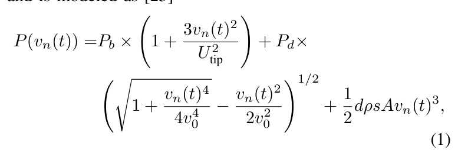

 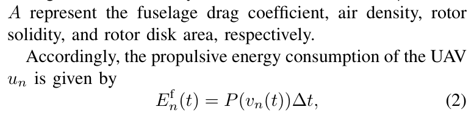

 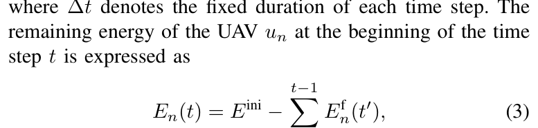

 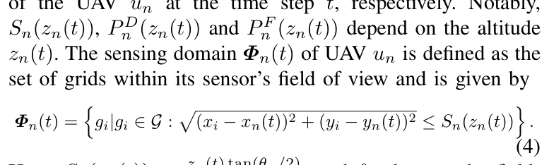

 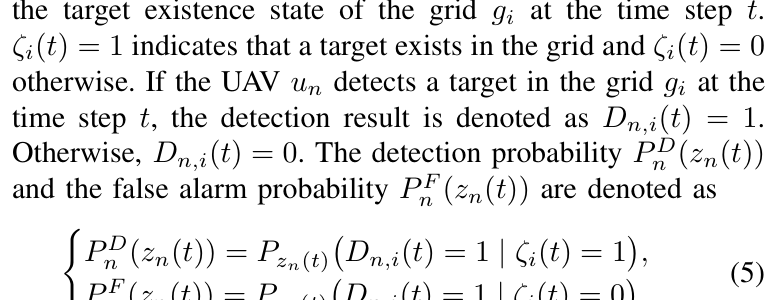

 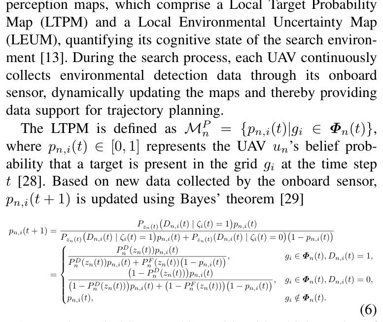

 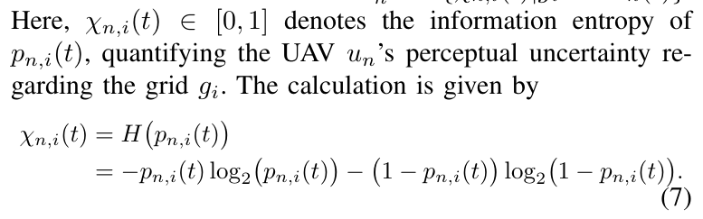

 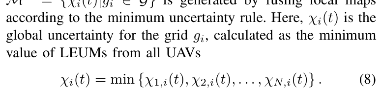

 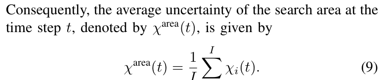

 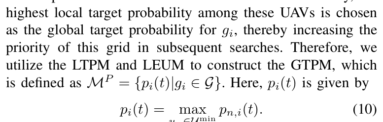

 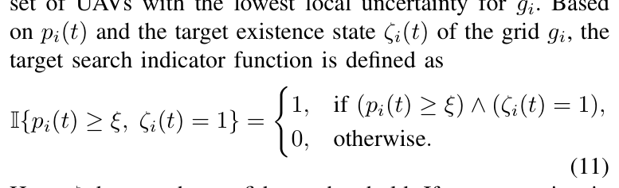

 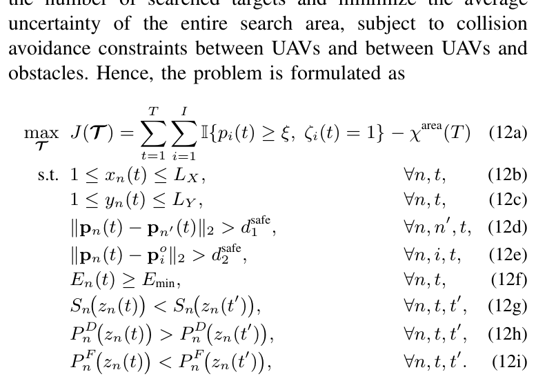

 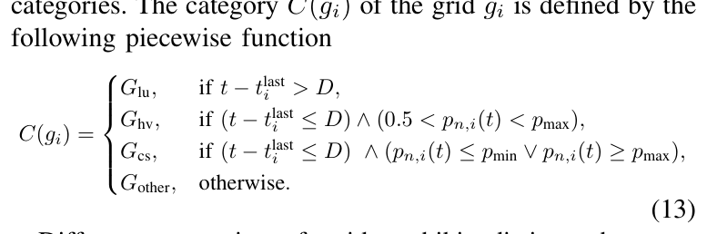

 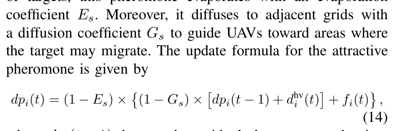

 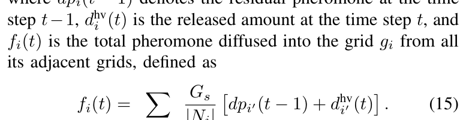

 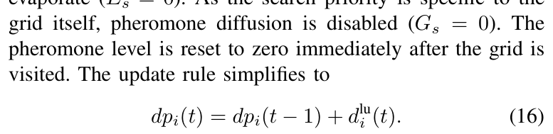

 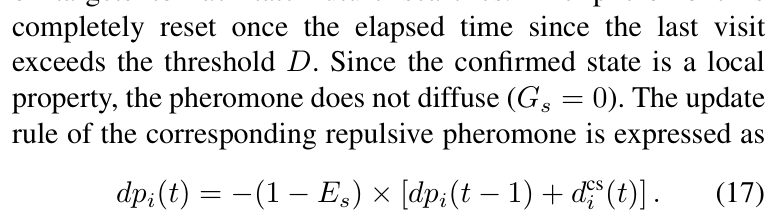

 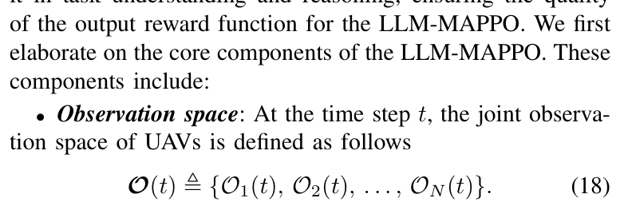

 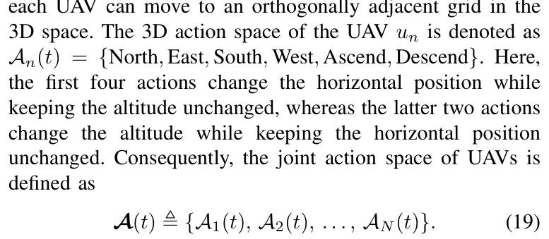

 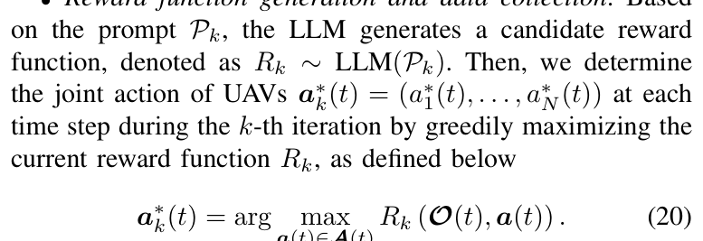

 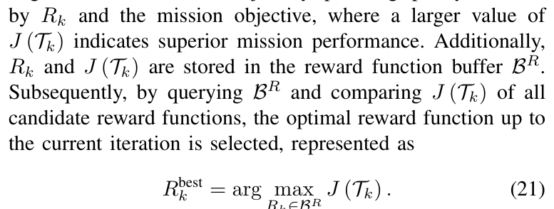

 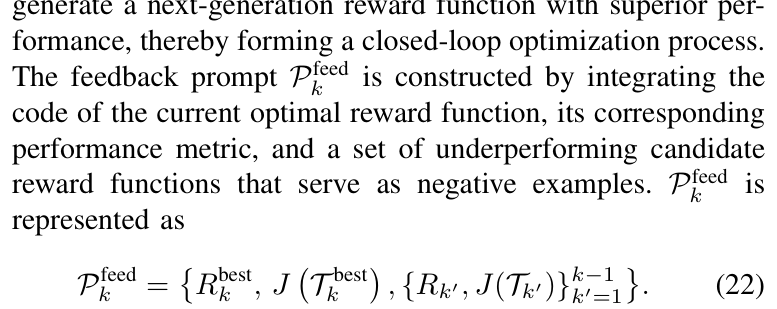

 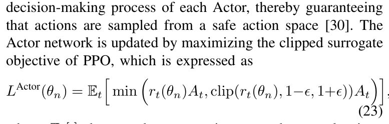

 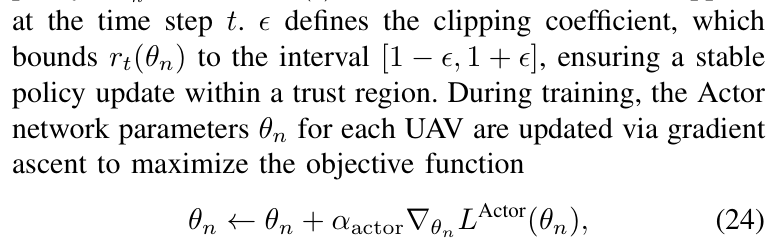

 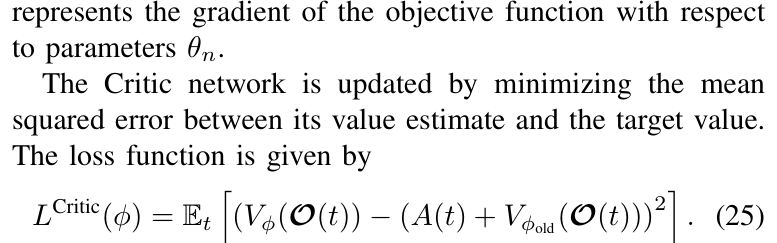

 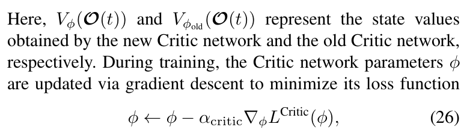

 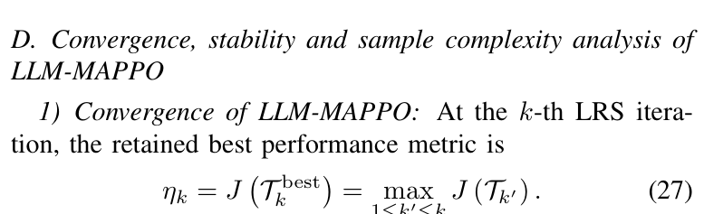

 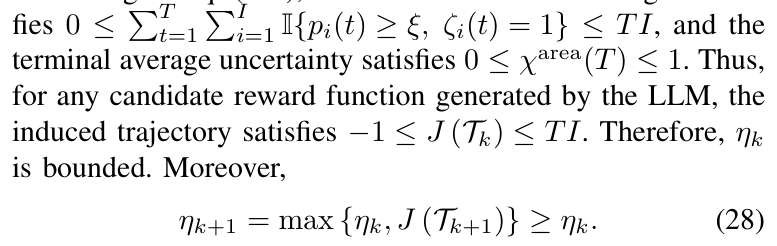

 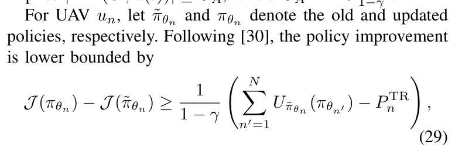
